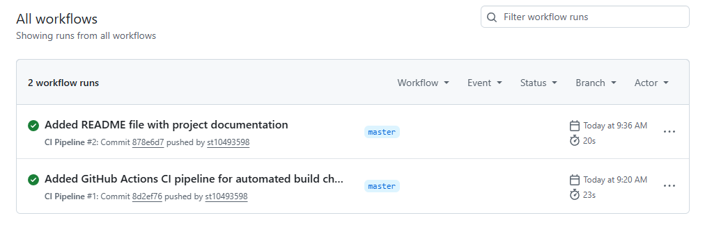

# Cybersecurity Awareness ChatBot

## Project Description
This is a chatbot application designed to educate users about cybersecurity threats such as phishing, malware, password safety, and safe browsing.

## Features
- Welcome message and audio greeting
- Interactive chatbot responses
- Keyword-based cybersecurity advice
- User-friendly console interface

## CI (GitHub Actions)
This project uses GitHub Actions for Continuous Integration. The workflow automatically:
- Restores dependencies
- Builds the project
- Checks for compilation errors on every push

## CI Workflow Proof

## How to Run
1. Open the project in Visual Studio
2. Run the application
3. Follow the chatbot prompts in the console